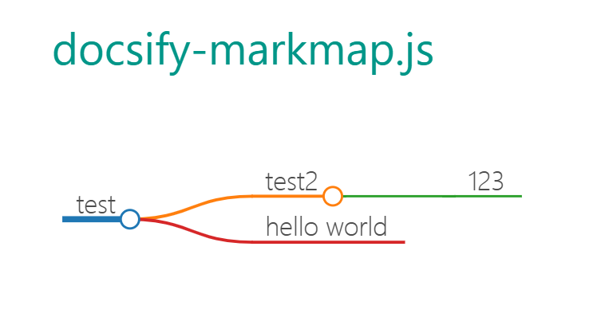

# docsify-markmap.js

🪄🪄🪄Create a new Markmap instance and render the code content on your Docsify

## How to use

### NPM or CDN
```
npm i docsify-markmap.js
```

```
add to index.html on your docsify.
<script src="https://cdn.jsdelivr.net/npm/markmap-autoloader@0.15.2"></script>
<script src="https://cdn.jsdelivr.net/npm/docsify-markmap.js@1.0.0/docsify-markmap.min.js"></script>
```

### Add markmap code on your markdown, you can see https://markmap.js.org/

```
```markmap
# test

## test2

 - 123

## hello world

 - 345
```(end)
```

### Open it on your docsify



## Thanks

https://github.com/docsifyjs/docsify/

https://github.com/markmap/markmap
